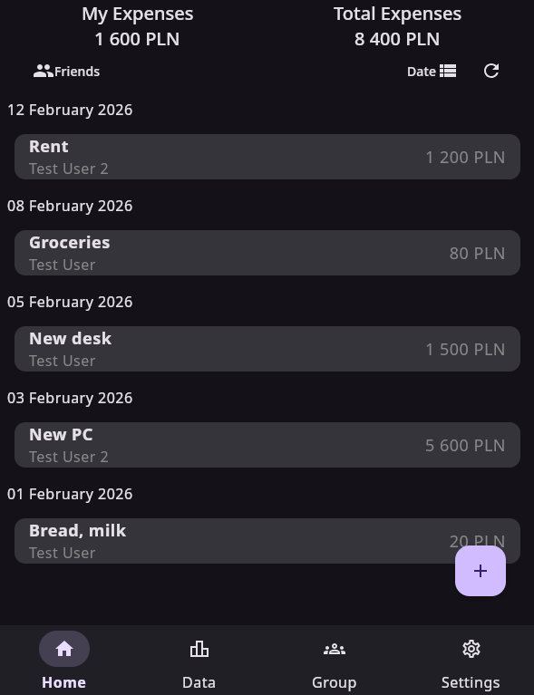
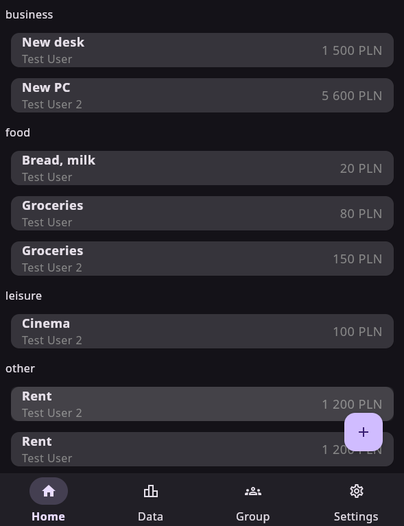
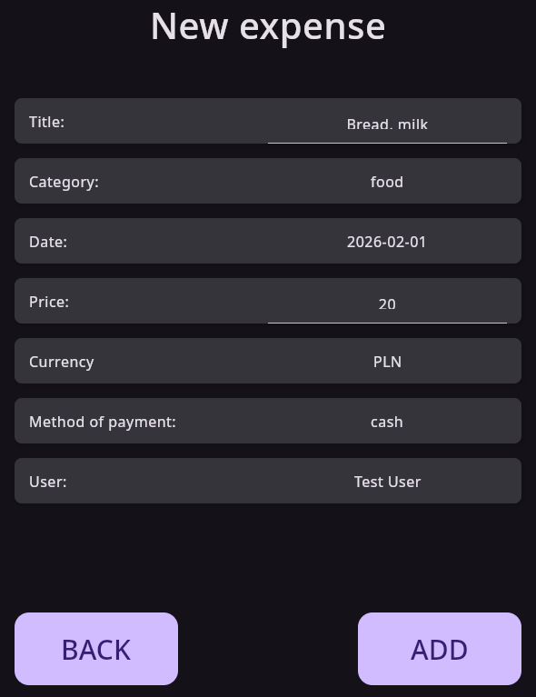
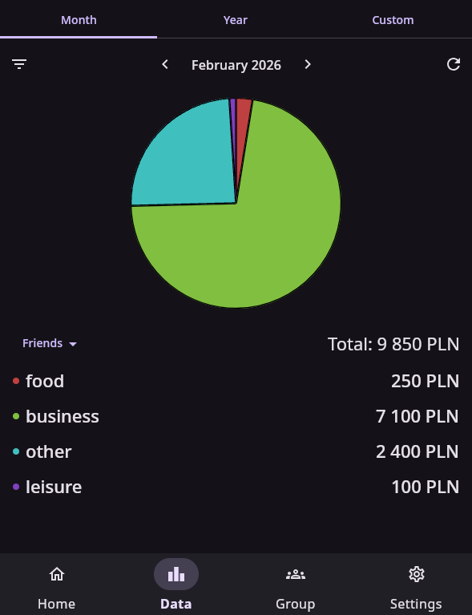
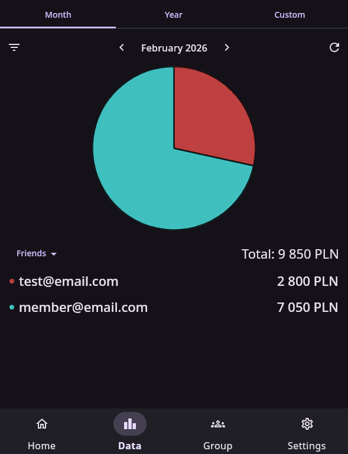
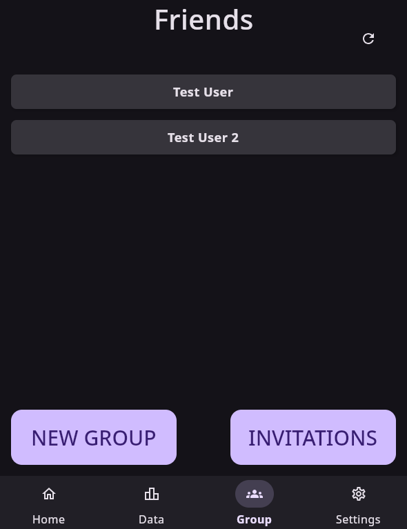
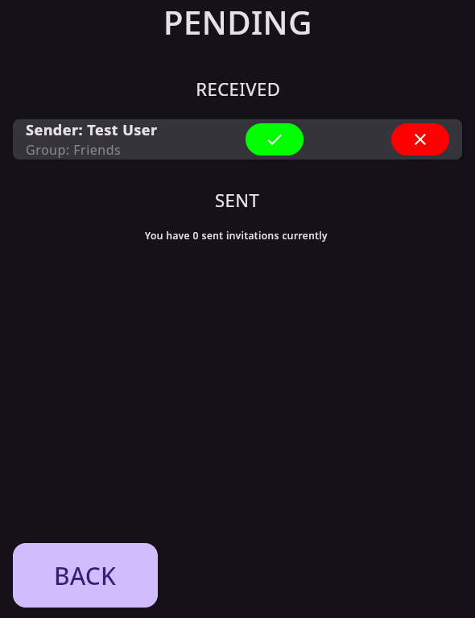

# Expense Tracker

## Running the Application

Java 21 is required to run the prototype.

### Linux

Install Java:

```bash
sudo apt-get install openjdk-21-jdk     # Ubuntu
sudo dnf install java-21-openjdk-devel  # Fedora
```

Run:

```bash
chmod +x start.sh
./start.sh
```

______________________________________________________________________

## PAP Z17

- Michał Suski 331439
- Michał Szwejk 331445
- Kamil Marszałek 331401
- Damian D'Souza 331368

______________________________________________________________________

## Project Description

The goal of the project is to build a mobile or web application for tracking
expenses. The application allows users to create accounts, join groups (e.g.
family groups), and view shared expenses. Expenses are presented chronologically
with support for filtering and grouping by various criteria such as date,
category, or user group. The application is backed by a database storing
information about users, groups, expenses, and categories.

______________________________________________________________________

## App Preview

### Login

<p align="center">
  
</p>

### Expense View

<p align="center">
  
</p>

### Expense View – Grouped by category

<p align="center">
  
</p>

### Add Expense

<p align="center">
  
</p>

### Expense stats by category

<p align="center">
  
</p>

### Expense stats by group members

<p align="center">
  
</p>

### Groups

<p align="center">
  
</p>

### Invite

<p align="center">
  
</p>

______________________________________________________________________

## Backend

### User Account Management

- Registration.
- Password handling.
- Ability to edit and delete accounts.

### Authentication System

- Login using username and password.

### User Database

- User data: name, login, account creation date.

### Expense Database

- Storing expense data: name, amount, category, date, description.
- Support for recurring expenses.
- User–expense relationship.

### Fetching Expense Data

- REST API for retrieving expenses as paginated lists.
- Filtering support by date, category, and amount.

### Expense Grouping

- Expense categorization (e.g. food, transport, entertainment).
- User-defined custom categories.

### Expense Statistics

- Monthly expense charts.
- Expense comparisons over time.
- Percentage breakdown by category.

______________________________________________________________________

## Frontend

### Data Display

- User interface with charts and tables.
- Real-time sorting and filtering.

### Add Expense Form

- Fields for name, amount, category, and description.
- Support for recurring expenses.

### Main Menu

- Navigation between screens: expenses, statistics, settings.

### Home Screen

- Quick expense overview: recent expenses, monthly balance.
- Add expense button.

### Settings Screen

- User profile editing.
- Expense category management.

______________________________________________________________________

## Additional Features to Consider

- Notifications.
- Offline mode (local storage via IndexedDB/SQLite).
- Monthly budgeting feature.

______________________________________________________________________

## Technologies

### Backend

- **Java 21 + Spring Boot**
  - Modules: Spring Security (authorization, encryption), Spring Data JPA
    (database management), Spring Web (REST API).

### Frontend

- **Kotlin with Compose Multiplatform**

### Database

- **Oracle Database** — relational database providing performance and
  scalability, with support for stored procedures and indexing.
- **SQL** — query execution and database management.
- **JDBC** — communication between Spring Boot and the Oracle database.

