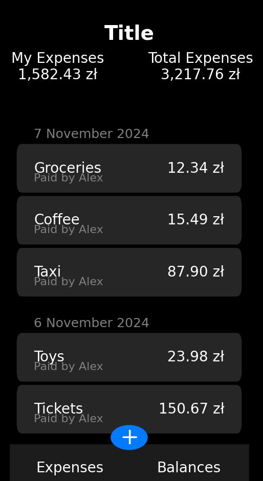

## PAP grupa 17
- Michał Suski		331439
- Michał Szwejk		331445
- Kamil Marszałek	331401
- Damian D’Souza	331368

## Opis projektu
Celem projektu jest zrealizowanie aplikacji mobilnej lub webowej pozwalającej na śledzenie wydatków. Aplikacja będzie umożliwiała użytkownikom tworzenie kont, łączenie kont w grupy (np. rodziny) oraz wyświetlanie wspólnych wydatków. W aplikacji wydatki będą prezentowane chronologicznie, z możliwością filtrowania i grupowania według różnych kryteriów, takich jak daty, kategorie, czy konkretne grupy użytkowników. Aplikacja będzie opierać się na wykorzystaniu bazy danych do przechowywania informacji o użytkownikach, grupach, wydatkach oraz kategoriach.

## Przykładowy interfejs

  

## Backend
### Zakładanie kont użytkowników
- Rejestracja.
- Obsługa haseł.
- Możliwość edycji i usuwania konta.

### System logowania
- Logowanie przy użyciu loginu i hasła.

### Baza danych z użytkownikami
- Dane użytkownika: imię, login, data utworzenia konta.

### Baza danych z wydatkami
- Przechowywanie danych o wydatkach: nazwa, kwota, kategoria, data, opis.
- Możliwość dodawania wydatków cyklicznych.
- Relacja użytkownik-wydatek.

### Pobieranie danych o wydatkach z bazy
- API REST do pobierania wydatków w formie paginowanych list.
- Wsparcie filtrowania według daty, kategorii, kwoty.

### Grupowanie wydatków
- Kategoryzacja wydatków (np. jedzenie, transport, rozrywka).
- Tworzenie niestandardowych kategorii przez użytkownika.

### Statystyki o wydatkach
- Wykresy miesięcznych wydatków.
- Porównania wydatków w czasie.
- Analiza procentowa wydatków w poszczególnych kategoriach.

### Testy jednostkowe
- Kontrola poprawności działania poszczególnych funkcji.
- Weryfikacja poprawności przesyłanych danych do i z bazy danych.

## Frontend
### Wyświetlanie danych
- Interfejs użytkownika z wykresami i tabelami.
- Sortowanie i filtrowanie danych w czasie rzeczywistym.

### Formularz do dodawania wydatków
- Pola do wprowadzania nazwy, kwoty, kategorii i opisu.
- Możliwość dodawania wydatków cyklicznych.

### Menu główne
- Nawigacja między ekranami: wydatki, statystyki, ustawienia.

### Ekran główny
- Szybki podgląd wydatków: ostatnie wydatki, bilans miesięczny.
- Przycisk dodawania wydatku.

### Ekran ustawień
- Edycja profilu użytkownika.
- Zarządzanie kategoriami wydatków.

## Dodatkowe funkcje do rozważenia
- Powiadomienia.
- Tryb offline (przechowywanie lokalne w IndexedDB/SQLite).
- Funkcja budżetowania miesięcznego.

## Technologie
### Backend
- **Spring Boot**
  - Framework do szybkiego budowania aplikacji w języku Java.
  - Moduły: Spring Security (autoryzacja, szyfrowanie), Spring Data JPA (zarządzanie bazą danych), Spring Web (API REST).

### Frontend
- **React.js**
- **Kotlin Multiplatform** (opcja alternatywna)

### Baza danych
- **Oracle Database**
  - Relacyjna baza danych zapewniająca wydajność i skalowalność.
  - Obsługa procedur przechowywanych (stored procedures) i indeksowania.
- **SQL**
  - Realizacja zapytań i obsługa bazy danych.
- **JDBC**
  - Komunikacja między Spring Boot a bazą danych Oracle.

## Wstępny podział ról
- **Kamil Marszałek** - backend
- **Michał Suski** - backend
- **Michał Szwejk** - baza danych, frontend
- **Damian D’Souza** - frontend